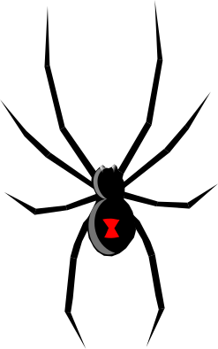

<!-- PROJECT LOGO -->
<p align="center">
  
</p>

<h1 align="center">🕷️ Widow v0.2</h1>

<p align="center">
  <b>Distributed Web Crawler + Vector Indexer for AI Search</b><br/>
  Built in Rust • Powered by Qdrant • Designed for Scale
</p>

<p align="center">
  <a href="https://www.rust-lang.org/"></a>
  <a href="https://qdrant.tech/"></a>
  <a href="https://www.docker.com/"></a>
  <a href="LICENSE"></a>
</p>

---

## 🌐 Overview

**Widow** is a **massively parallel, Rust-based crawler** built to collect and embed the world’s knowledge into vector databases.  
It is inspired by Exa’s mission — to make high-quality web data indexable for every AI system — and optimized for modern AI search pipelines.

<p align="center">
  
</p>

---

## 🚀 Quick Start

````bash
# Clone the repo
git clone https://github.com/<yourusername>/widow.git
cd widow

# Build and run all services
docker compose up --build
You’ll see logs like:

🧠 Waiting for Qdrant...
✅ Qdrant is up! Starting Widow...
🕷️ Crawling: https://example.com
✅ Indexed https://example.com (129 chars)


Then visit the Qdrant dashboard:
👉 http://localhost:6333/dashboard

🧩 Architecture
┌────────────────────┐
│   widow-worker     │   → Crawls + embeds web pages
│  (Rust binary)     │   → Sends vectors to Qdrant
└─────────┬──────────┘
          │ gRPC / REST
          ▼
┌────────────────────┐
│   Qdrant VectorDB  │   → Stores page embeddings + metadata
│  (Docker service)  │   → Serves semantic queries
└────────────────────┘

<details> <summary>📦 Core Components</summary>
Component	Description	Tech
widow-core	Shared models + async utilities	Rust + Tokio
widow-worker	Main crawler / pipeline runner	Reqwest + Scraper
widow-embedder	Embedding + Qdrant client	HTTP + JSON API
widow-extractor	HTML → text + metadata parsing	CSS Selectors
widow-scheduler	(Planned) smart crawl rate limiter	Future queue system
</details>
🧠 Environment Variables
Variable	Default	Description
QDRANT_URL	http://qdrant:6334	Qdrant service endpoint
RUST_LOG	info	Logging level
WIDOW_MODE	worker	Crawler execution mode
🧪 Verify Indexing

After Widow runs, query Qdrant:

curl http://localhost:6333/collections


Example output:

{
  "result": [
    {
      "name": "widow_pages",
      "vectors_count": 2,
      "status": "green"
    }
  ]
}


Or perform a search:

curl -X POST http://localhost:6333/collections/widow_pages/points/search \
  -H "Content-Type: application/json" \
  -d '{"vector":[0.1,0.2,0.3],"limit":5}'

🧰 Tech Stack
Layer	Technology
Language	🦀 Rust (Tokio, Reqwest, Serde)
Database	🧠 Qdrant VectorDB
Infra	🐋 Docker Compose
Logging	Env-aware structured logging
Crawling	Async concurrent fetcher w/ politeness control
Embedding	Pluggable stub (future model integration)
🪶 Roadmap

 ☑️ Async crawler pipeline (fetch → parse → embed → index)

 ☑️ Docker Compose environment (worker + vector DB)

 Distributed crawl scheduling & politeness

 Adaptive rate limiting per domain

 Incremental re-crawl detection

 Widow Dashboard (Next.js + Supabase)

 Integration with local embedding models (GGUF / Ollama)

🧭 Example Use Cases

AI search indexer for your domain

RAG data ingestion engine

Local knowledge crawler

Open-web embeddings dataset builder

⚙️ Development Notes
# Run only the crawler locally
cargo run -p widow-worker

# Run in Docker Compose (recommended)
docker compose up --build


Logs and crawl data are stored in:

data/
├── qdrant/   # Vector storage volume
└── crawls/   # Crawl logs + cache

🧱 Project Tree
widow/
├── Cargo.toml
├── Dockerfile
├── docker-compose.yml
├── crates/
│   ├── widow-core/
│   ├── widow-worker/
│   ├── widow-embedder/
│   ├── widow-extractor/
│   └── widow-scheduler/   # future
└── data/
    ├── qdrant/
    └── crawls/

💡 Credits & License

Built by Taahirah Denmark

Licensed under the MIT License

<p align="center"> <sub>Widow © 2025 — Crawling the web, one vector at a time.</sub> </p> ```
````
